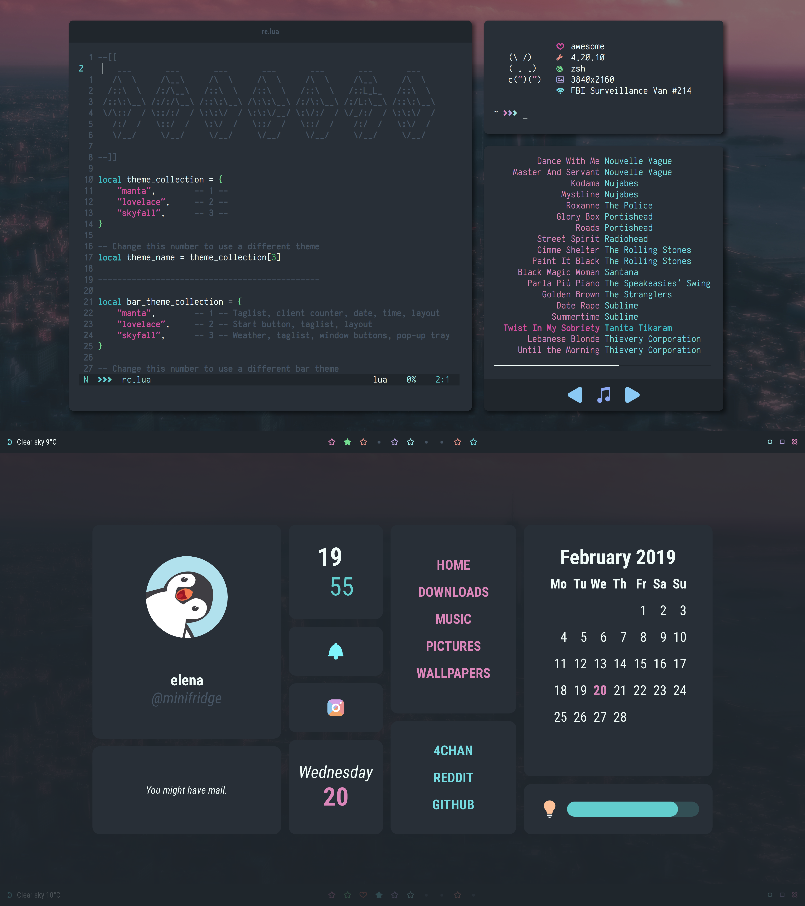

<p align="center">
  <a href="https://github.com/exshak/dotfiles">
    
  </a>
</p>

<p align="center">
  <b>⎋ dotfiles by exshak ⎋</b>
</p>

<p align="center">
  <a href="#cherry_blossom-setup">
    
  </a>
</p>

### :octocat: Hi there, thanks for dropping by! 



🎯 `curl -sL exshak.com/dotfiles | bash`

This is my **personal configuration** for unix based operating systems (OS) and everyday applications. \
The [setup](#cherry_blossom-setup) section will guide you through the install.

Here are some details about my setup:

- **OS** • [macOS](https://en.wikipedia.org/wiki/MacOS) , [Arch Linux](https://wiki.archlinux.org)  coming soon!
- **Shell** • [Zsh](https://github.com/zsh-users/zsh) 🐚 with [zinit](https://github.com/zdharma/zinit) framework! <kbd>optional</kbd>
- **Terminal** • [Alacritty](https://github.com/alacritty/alacritty), [iTerm2](https://github.com/gnachman/iTerm2), [Kitty](https://github.com/kovidgoyal/kitty) <kbd>available</kbd>
- **Multiplexer** • [Tmux](https://github.com/tmux/tmux) with [.tmux](https://github.com/gpakosz/.tmux) and [tpm](https://github.com/tmux-plugins/tpm) plugins!
- **Text Editor** • [Neovim](https://github.com/neovim/neovim)  with [plug](https://github.com/junegunn/vim-plug), [Doom Emacs](https://github.com/hlissner/doom-emacs)
- **Graphical IDE** • [VSCode](https://github.com/microsoft/vscode)  with [neovim](https://github.com/asvetliakov/vscode-neovim), [Xcode](https://developer.apple.com/xcode)
- **Window Manager** • [Yabai](https://github.com/koekeishiya/yabai) with [Übersicht](https://github.com/felixhageloh/uebersicht) widgets!
- **Linux Environment** • [AWM](https://github.com/awesomeWM/awesome), [Dunst](https://github.com/dunst-project/dunst), [Picom](https://github.com/yshui/picom), [Polybar](https://github.com/polybar/polybar)
- **Application Launcher** • [Alfred](https://www.alfredapp.com) 🧢, [Rofi](https://github.com/davatorium/rofi) 🔍, [sxhkd](https://github.com/baskerville/sxhkd)
- **Other** • [fzf](https://github.com/junegunn/fzf), [neomutt](https://github.com/neomutt/neomutt), [nnn](https://github.com/jarun/nnn), [zathura](https://github.com/pwmt/zathura) and more! 🎒

## 🌸 Setup 

1. Install the dotfiles into a [bare repo](https://www.atlassian.com/git/tutorials/dotfiles).

   **macOS** • [Homebrew](https://brew.sh) and Xcode command line tools will be automatically installed.

   ```shell
   curl -sL exshak.com/dotfiles | bash
   ```

   Pre-existing dotfiles will be backed up.

2. Install [dependencies]() and enable [services]().

   - **macOS** • Edit the [`~/.brewfile`](./.brewfile) and choose which applications you want to install.

     ```shell
     brew bundle --file=~/.brewfile

     # For Apple Silicon
     sudo softwareupdate --install-rosetta --agree-to-license
     ```

   - **Arch Linux** • (and all Arch-based distributions)

     <details>
     • Coming Soon!
     </details>

3. Install system defaults and user configs.

   **macOS** • Customize the [`~/.macos`](./.macos) file and adjust the settings to your preference.

   ```shell
   bash ~/.macos
   ```

   Restart for changes to take effect.

## 🎉 Credits

[Dotfiles](https://dotfiles.github.io)
